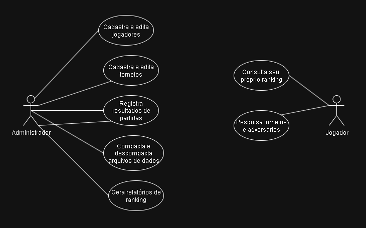
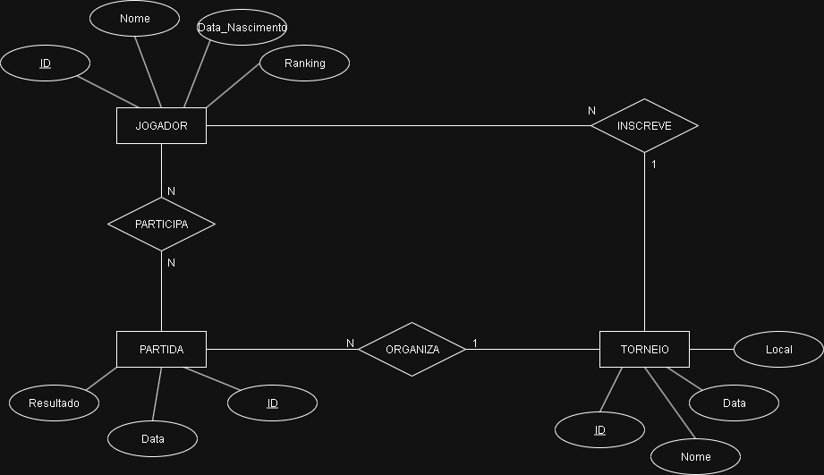

## Introdução
Este é um trabalho prático da disciplina de Algoritmos e Estruturas de Dados III (AEDS III) do curso de Ciência da Computação da Pontifícia Universidade Católica de Minas Gerais.
- Trabalho feito por: João Comini César de Andrade

## Tema Do Sistema
### Sistema de Gerenciamento de Torneios e Jogadores de Tênis
O sistema permitirá o cadastro e gerenciamento de torneios, jogadores, partidas e rankings, com funcionalidades para registrar resultados, atualizar pontuações e gerar estatísticas.

## Descrição do Problema
Atualmente, muitos clubes e organizadores de torneios de tênis utilizam planilhas ou anotações manuais para gerenciar inscrições, partidas e rankings. Isso gera problemas como:
- Dificuldade para encontrar rapidamente informações sobre jogadores e partidas passadas.
- Falta de padronização no registro de resultados.
- Risco de perda de dados e inconsistências.
- Ausência de um histórico centralizado para estatísticas e evolução dos atletas.
O sistema proposto visa resolver esses problemas oferecendo uma plataforma digital para:
  1. Cadastrar jogadores, torneios e partidas.
  2. Registrar resultados e atualizar rankings automaticamente.
  3. Pesquisar jogadores ou partidas por nome (usando casamento de padrões).
  4. Garantir segurança das informações com criptografia de senhas.
  5. Otimizar buscas com índices B+ e hash extensível.
  6. Armazenar dados de forma compactada para economia de espaço.

## Objetivo do Trabalho
Desenvolver um sistema que:
- Permita CRUD completo de Jogadores, Torneios e Partidas.
- Implemente relacionamentos 1:N (ex.: Torneio → Partidas) e N:N (ex.: Jogadores ↔ Partidas).
- Utilize persistência em arquivos binários com cabeçalho e exclusão lógica (lápide).
- Ofereça busca rápida e ordenada por índices B+ e hash extensível.
- Implemente criptografia XOR para senhas de usuários.
- Disponibilize compactação/descompactação dos arquivos de dados.
- Permita pesquisa textual por nome de jogador ou torneio usando BM ou KMP.

## Requisitos Funcionais (RF)
- **RF01:** Cadastrar jogador (nome, data de nascimento, ranking, lista de torneios disputados).
- **RF02:** Cadastrar torneio (nome, local, data, lista de jogadores inscritos).
- **RF03:** Registrar partida (jogadores, data, resultado, torneio associado).
- **RF04:** Atualizar ranking de jogadores automaticamente após partidas.
- **RF05:** Pesquisar jogador ou torneio por nome (casamento de padrões).
- **RF06:** Listar registros ativos e permitir exclusão lógica.
  
## Requisitos Não Funcionais (RNF)
- **RNF01:** Interface gráfica (HTML/CSS)
- **RNF02:** Persistência em arquivos binários com cabeçalho.
- **RNF03:** Uso de índices B+ e hash extensível para buscas.
- **RNF04:** Criptografia XOR para senhas.
- **RNF05:** Compactação Huffman ou LZW para arquivos de dados.

## Atores
- **Administrador:** Gerencia cadastros, partidas e rankings.
- **Usuário/Jogador:** Consulta informações sobre torneios e rankings.

## Diagrama de Caso de Uso

## Diagrama Entidade-Relacionamento

## Arquitetura Proposta
O sistema seguirá o padrão **MVC + DAO**, onde:
- **Model:** Classes de domínio (Jogadores, Torneios, Partidas).
- **DAO (Data Access Object):** Responsável pela persistência dos dados em arquivos binários e aos seus acessos, utilizando cabeçalhos e exclusão lógica (lápide).
- **Controller:** Regras de negócio e controle de fluxo da aplicação.
- **View:** Interface gráfica para interação com o usuário (HTML/CSS).