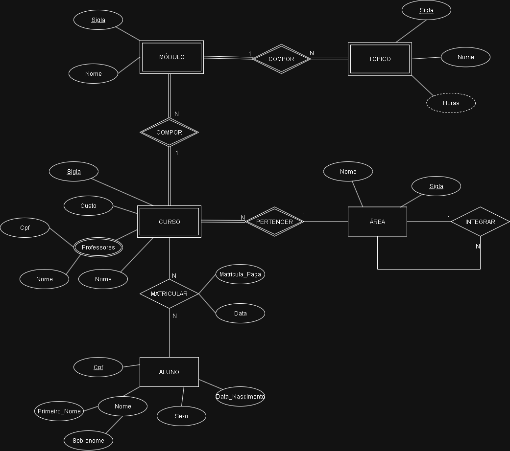

# **HO02**
## *ENUNCIADO:*
Gerar um modelo conceitual representado como um diagrama entidade-relacionamento (DER) usando a notação de Peter Chen a partir da seguinte descrição de minimundo:
    Esta é a descrição textual de minimundo do SAM (v1.0). O SAM (Sistema Acadêmico de Matrículas) 
    gerencia a matrícula de alunos em cursos em instituições de ensino. 
    Em particular, os cursos da instituição de ensino são categorizados por áreas de conhecimento, 
    sendo que um curso obrigatoriamente pertence a uma área e uma área pode possuir vários cursos. 
    Além disso, uma área pode ser integrada por outras áreas, sendo que uma área só pode ser integrante de 
    uma única área. As áreas são identificadas por sua sigla e possuem um nome. Os cursos são identificados por 
    sua sigla e possuem nome, custo e professores, compostos por CPF e nome. Alunos são identificados pelo seu CPF 
    e possuem nome, composto de primeiro nome e sobrenome, sexo e data de nascimento. Cada aluno pode se matricular 
    em diversos cursos, sendo que em cada curso podemos ter diversos alunos matriculados, mas devemos conhecer a data 
    e se o aluno pagou ou não a matrícula no curso. Cada curso é composto por módulos, sendo que um módulo compõe 
    apenas um curso e não existem módulos sem vínculo a algum curso. Cada módulo é identificado por sua sigla e 
    possui um nome. Cada módulo é composto por tópicos, sendo que cada tópico só existe em função de um módulo. 
    Um tópico potencialmente pode ser identificado por sua sigla e possui nome e horas (carga horária do tópico). 
    As horas do curso são derivadas da totalização das horas dos tópicos que compõem os módulos dos cursos.

    Elementos do DER
    - SUBSTANTIVO -> Pode indicar atributo ou entidade 
    - VERBO -> Pode indicar relacionamento

# DER - Sistema Acadêmico de Matrículas (SAM)
