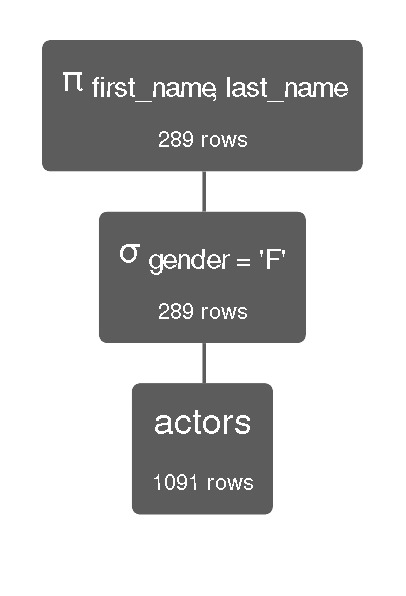
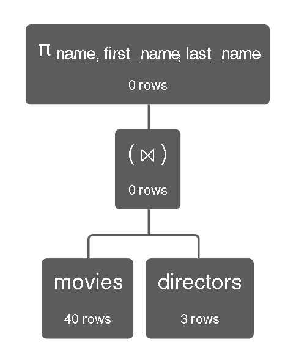

# HO04
## ENUNCIADO:

Especificar as seguintes consultas em álgebra relacional para recuperar os dados em um banco de dados relacional, considerando o conjunto de dados (dataset) denominado IMDB-sample disponível na calculadora RelaXLinks to an external site.

## 1. Projetar o primeiro nome e o último nome dos atores de sexo feminino;
```
π first_name, last_name (σ gender= 'F'(actors))
```


## 2. Projetar o nome dos filmes com ano superior à 1999;
```
π name (σ year ≥ 2000 (movies))
```


## 3. Projetar o nome do filme e o nome do diretor de cada filme;
```
π name, first_name, last_name (movies ⨝ directors)
```

