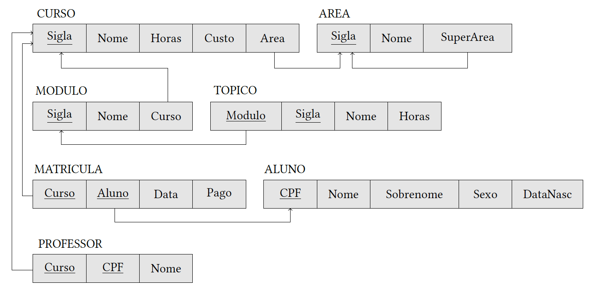

# HO04

## ENUNCIADO:
Construir um diagrama de implementação do banco de dados SAM a partir do modelo relacional abaixo e especificar consultas em SQL para criar o esquema, as tabelas e restrições (domínio, nulidade, unicidade, valor, valor padrão, chave e integridade referencial) do banco de dados SAM.



## CRIAÇÃO DO ESQUEMA SAM
```
CREATE SCHEMA SAM AUTHORIZATION 'Joao';
```

## CRIAR TABELA CURSO
```
CREATE TABLE CURSO(
    Sigla CHAR(4) NOT NULL,
    Nome VARCHAR(100) NOT NULL,
    Horas INT NOT NULL,
    Custo FLOAT,
    Area CHAR(4) NOT NULL,
    CONSTRAINT PK_CURSO PRIMARY KEY (Sigla),
    CONSTRAINT FK_CURSO FOREIGN KEY (Area)
    REFERENCES AREA(Sigla)
    ON DELETE RESTRICT -- Impede a exclusão da Área se houver Cursos nela
    ON UPDATE CASCADE -- Se a sigla da Área mudar, atualiza aqui também
);
```

## CRIAR TABELA AREA
```
CREATE TABLE AREA(
    Sigla CHAR(4) NOT NULL,
    Nome VARCHAR(50) NOT NULL,
    SuperArea CHAR(4),
    CONSTRAINT PK_AREA PRIMARY KEY (Sigla),
    CONSTRAINT UNIQUE_AREA_NOME UNIQUE (Nome) -- Evitar nomes duplicados de área
);
ALTER TABLE AREA
    ADD CONSTRAINT FK_SuperArea FOREIGN KEY (SuperArea)
    REFERENCES AREA(Sigla)
    ON DELETE RESTRICT 
    ON UPDATE CASCADE;
```

## CRIAR TABELA MODULO
```
CREATE TABLE MODULO(
    Sigla CHAR(4) NOT NULL,
    Nome VARCHAR(80) NOT NULL,
    Curso CHAR(4) NOT NULL,
    CONSTRAINT PK_Modulo PRIMARY KEY (Sigla),
    CONSTRAINT FK_Modulo FOREIGN KEY (Curso)
    REFERENCES CURSO(Sigla)
    ON DELETE CASCADE
    ON UPDATE CASCADE
);
```

## CRIAR TABELA TOPICO
```
CREATE TABLE TOPICO(
    Modulo CHAR(4) NOT NULL,
    Sigla CHAR(4) NOT NULL,
    Nome VARCHAR(80) NOT NULL,
    Horas INT NOT NULL,
    CONSTRAINT PK_TOPICO PRIMARY KEY (Modulo, Sigla),
    CONSTRAINT FK_TOPICO FOREIGN KEY (Modulo)
    REFERENCES MODULO (Sigla)
    ON DELETE CASCADE
    ON UPDATE CASCADE,
    CONSTRAINT CHECAR_HORAS_TOPICO CHECK (Horas > 0)
);
```

## CRIAR TABELA ALUNO
```
CREATE TABLE ALUNO(
    CPF CHAR(11) NOT NULL,
    Nome VARCHAR(80) NOT NULL,
    Sobrenome VARCHAR(150) NOT NULL,
    Sexo CHAR(1) NOT NULL,
    DataNasc DATE NOT NULL,
    CONSTRAINT PK_ALUNO PRIMARY KEY (CPF)
);
ALTER TABLE ALUNO ADD CONSTRAINT CHECAR_SEXO_ALUNO CHECK (Sexo IN ('M', 'F'));
```

## CRIAR TABELA MATRICULA
```
CREATE TABLE MATRICULA(
    Curso CHAR(4) NOT NULL,
    Aluno CHAR(11) NOT NULL,
    Data DATE NOT NULL,
    Pago BOOLEAN NOT NULL DEFAULT FALSE,
    CONSTRAINT PK_MATRICULA PRIMARY KEY(Curso, Aluno),
    CONSTRAINT FKCurso_MATRICULA FOREIGN KEY(Curso)
    REFERENCES CURSO(Sigla)
    ON DELETE CASCADE
    ON UPDATE CASCADE,
    CONSTRAINT FKAluno_MATRICULA FOREIGN KEY(Aluno)
    REFERENCES ALUNO(CPF)
    ON DELETE RESTRICT
    ON UPDATE CASCADE
);
```

## CRIAR TABELA PROFESSOR
```
CREATE TABLE PROFESSOR(
    Curso CHAR(4) NOT NULL,
    CPF CHAR(11) NOT NULL, 
    Nome VARCHAR(80) NOT NULL,
    CONSTRAINT PK_PROFESSOR PRIMARY KEY (Curso, CPF),
    CONSTRAINT FK_PROFESSOR FOREIGN KEY (Curso)
    REFERENCES CURSO(Sigla)
    ON DELETE RESTRICT 
    ON UPDATE CASCADE
);
```