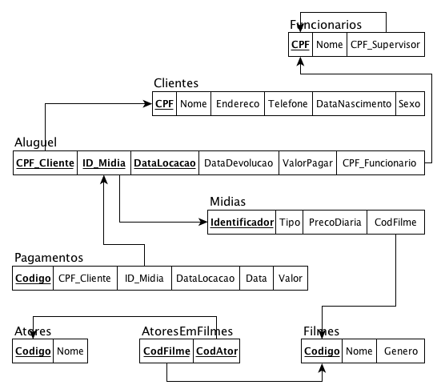

# HO10
## Enunciado:
Construir um índice primário e índices secundários (para cada chave estrangeira) para cada arquivo (tabela) presente no modelo relacional abaixo, apresentando a blocagem (fator de bloco), o número de blocos necessários para armazenar o arquivo de índice, o espaço desperdiçado por bloco em cada arquivo de índice, o espaço total gasto para armazenar cada arquivo de índice e o número de acessos a blocos necessários para recuperar um registro usando cada índice construído.

Considere que o ponteiro para blocos de disco tem 16B, que o tamanho de bloco de disco é de 2KB, que os arquivos possuem registros de tamanho fixo, não espalhados e que eles têm a seguinte configuração de número de registros e tamanhos de campos:

- Atores (10.000 registros) → Codigo (16B), Nome (160B)
- Clientes (100.000 registros) → CPF (11B), Nome (160B), Endereco (200B), Telefone (16B), 
- DataNascimento (12B), Sexo (1B)
- Filmes (2.000.000 registros) → Codigo (16B), Nome (160B), Genero (80B)
- Funcionarios (3.500 registros) → CPF (11B), Nome (160B)
- Midias (10.000.000 registros) → Identificador (24B), Tipo (8B), PrecoDiaria (24B)
- Aluguel (20.000.000 registros)  → DataLocacao (12B), DataDevolucao (10B), ValorPagar (24B)
- Pagamentos (50.000.000 registros) → Codigo (48B), Data (12B), Valor (24B)
- AtoresEmFilmes (1.000.000 registros)
Observem a existência de chaves estrangeiras que obviamente devem ser consideradas como campos integrantes dos arquivos.

## Respostas:
- **Dados do problema:**
    - Tamanho do Ponteiro: 16B
    - Tamanho do Bloco de Disco: 2KB (ou seja, 2048 Bytes)
- **Formulas que serão usadas:**
    - Tamanho do Registro de Dados (R): Soma dos tamanhos dos campos da tabela.
    - Fator de Bloco do Arquivo de Dados (F): $F = \lfloor \frac{\text{Tamanho do Bloco}}{R} \rfloor$
    - Número de Blocos do Arquivo de Dados ($B$): $B = \lceil \frac{\text{Número de Registros}}{F} \rceil$
    - Tamanho do Registro de Índice ($R_{indice}$): $R_{indice} = \text{Tamanho do Campo Indexado} + \text{Tamanho do Ponteiro}$
    - Fator de Bloco do Arquivo de Índice ($F_{indice}$): $F_{indice} = \lfloor \frac{\text{Tamanho do Bloco}}{R_{indice}} \rfloor$
    - Número de Registros do Índice ($r_{indice}$):
        - Para Índice Primário: $r_{indice} = B$ (esparso)
        - Para Índice Secundário: $r_{indice} = \text{Número de Registros da Tabela}$ (denso)
    - Número de Blocos do Arquivo de Índice ($B_{indice}$): $B_{indice} = \lceil \frac{r_{indice}}{F_{indice}} \rceil$
    - Espaço Desperdiçado por Bloco (em blocos cheios): $\text{Tamanho do Bloco} - (F_{indice} \times R_{indice})$
    - Espaço Total do Índice: $B_{indice} \times \text{Tamanho do Bloco}$
    - Número de Acessos a Bloco: $A = \lceil \log_{2}(B_{indice}) \rceil + 1$ (o +1 é para acessar o bloco de dados final). Log de 2 na calculadora -> log x / log 2

1. Tabela **ATORES**
- DADOS: 10.000 registros. PK: Codigo (16B). Campos: Codigo (16B), Nome (160B).
- **Cálculos do Arquivo de Dados:**
    - $R = 16 + 160 = 176B$
    - $F = \lfloor \frac{2048}{176} \rfloor = 11$
    - $B = \lceil \frac{10000}{11} \rceil = 910$ blocos
- **Índice Primário em `Codigo`**
    - $R_{indice} = 16 + 16 = 32B$
    - $F_{indice} = \lfloor \frac{2048}{32} \rfloor = 64$
    - $r_{indice} = 910$
    - $B_{indice} = \lceil \frac{910}{64} \rceil = 15$ blocos
    - **Blocagem (Fator de Bloco):** 64
    - **Número de Blocos do Índice:** 15
    - **Espaço Desperdiçado por Bloco:** $2048 - (64 \times 32) = 0B$
    - **Espaço Total do Índice:** $15 \times 2048B = 30.720B$ (30KB)
    - **Acessos a Bloco:** $\lceil \log_{2}(15) \rceil + 1 = 4 + 1 = 5$

2. Tabela **CLIENTES**
- DADOS: 100.000 registros. PK: CPF (11B). Campos: CPF (11B), Nome (160B), Endereco (200B), Telefone (16B), DataNascimento (12B), Sexo (1B).
- **Cálculos do Arquivo de Dados:**
    - $R = 11 + 160 + 200 + 16 + 12 + 1 = 400B$
    - $F = \lfloor \frac{2048}{400} \rfloor = 5$
    - $B = \lceil \frac{100000}{5} \rceil = 20.000$ blocos
- **Índice Primário em `CPF`**
    - $R_{indice} = 11 + 16 = 27B$
    - $F_{indice} = \lfloor \frac{2048}{27} \rfloor = 75$
    - $r_{indice} = 20.000$
    - $B_{indice} = \lceil \frac{20000}{75} \rceil = 267$ blocos
    - **Blocagem (Fator de Bloco):** 75
    - **Número de Blocos do Índice:** 267
    - **Espaço Desperdiçado por Bloco:** $2048 - (75 \times 27) = 23B$
    - **Espaço Total do Índice:** $267 \times 2048B = 546.816B$ (534KB)
    - **Acessos a Bloco:** $\lceil \log_{2}(267) \rceil + 1 = 9 + 1 = 10$

3. Tabela **FILMES**
- DADOS: 2.000.000 registros. PK: Codigo (16B). Campos: Codigo (16B), Nome (160B), Genero (80B).
- **Cálculos do Arquivo de Dados:**
    - $R = 16 + 160 + 80 = 256B$
    - $F = \lfloor \frac{2048}{256} \rfloor = 8$
    - $B = \lceil \frac{2000000}{8} \rceil = 250.000$ blocos
- **Índice Primário em `Codigo`**
    - $R_{indice} = 16 + 16 = 32B$
    - $F_{indice} = \lfloor \frac{2048}{32} \rfloor = 64$
    - $r_{indice} = 250.000$
    - $B_{indice} = \lceil \frac{250000}{64} \rceil = 3.907$ blocos
    - **Blocagem (Fator de Bloco):** 64
    - **Número de Blocos do Índice:** 3.907
    - **Espaço Desperdiçado por Bloco:** $2048 - (64 \times 32) = 0B$
    - **Espaço Total do Índice:** $3.907 \times 2048B = 8.001.536B$ (7.63MB)
    - **Acessos a Bloco:** $\lceil \log_{2}(3907) \rceil + 1 = 12 + 1 = 13$

4. Tabela **FUNCIONARIOS**
- DADOS: 3.500 registros. PK: CPF (11B). FK: CPF_Supervisor (11B). Campos: CPF (11B), Nome (160B), CPF_Supervisor (11B).
- **Cálculos do Arquivo de Dados:**
    - $R = 11 + 160 + 11 = 182B$
    - $F = \lfloor \frac{2048}{182} \rfloor = 11$
    - $B = \lceil \frac{3500}{11} \rceil = 319$ blocos
- **Índice Primário em `CPF`**
    - $R_{indice} = 11 + 16 = 27B$
    - $F_{indice} = \lfloor \frac{2048}{27} \rfloor = 75$
    - $r_{indice} = 319$
    - $B_{indice} = \lceil \frac{319}{75} \rceil = 5$ blocos
    - **Blocagem (Fator de Bloco):** 75
    - **Número de Blocos do Índice:** 5
    - **Espaço Desperdiçado por Bloco:** $2048 - (75 \times 27) = 23B$
    - **Espaço Total do Índice:** $5 \times 2048B = 10.240B$ (10KB)
    - **Acessos a Bloco:** $\lceil \log_{2}(5) \rceil + 1 = 3 + 1 = 4$
- **Índice Secundário em `CPF_Supervisor`**
    - $R_{indice} = 11 + 16 = 27B$
    - $F_{indice} = \lfloor \frac{2048}{27} \rfloor = 75$
    - $r_{indice} = 3.500$
    - $B_{indice} = \lceil \frac{3500}{75} \rceil = 47$ blocos
    - **Blocagem (Fator de Bloco):** 75
    - **Número de Blocos do Índice:** 47
    - **Espaço Desperdiçado por Bloco:** $2048 - (75 \times 27) = 23B$
    - **Espaço Total do Índice:** $47 \times 2048B = 96.256B$ (94KB)
    - **Acessos a Bloco:** $\lceil \log_{2}(47) \rceil + 1 = 6 + 1 = 7$

5. Tabela **MIDIAS**
- DADOS: 10.000.000 registros. PK: Identificador (24B). FK: CodFilme (16B). Campos: Identificador (24B), Tipo (8B), PrecoDiaria (24B), CodFilme (16B).
- **Cálculos do Arquivo de Dados:**
    - $R = 24 + 8 + 24 + 16 = 72B$
    - $F = \lfloor \frac{2048}{72} \rfloor = 28$
    - $B = \lceil \frac{10000000}{28} \rceil = 357.143$ blocos
- **Índice Primário em `Identificador`**
    - $R_{indice} = 24 + 16 = 40B$
    - $F_{indice} = \lfloor \frac{2048}{40} \rfloor = 51$
    - $r_{indice} = 357.143$
    - $B_{indice} = \lceil \frac{357143}{51} \rceil = 7.003$ blocos
    - **Blocagem (Fator de Bloco):** 51
    - **Número de Blocos do Índice:** 7.003
    - **Espaço Desperdiçado por Bloco:** $2048 - (51 \times 40) = 8B$
    - **Espaço Total do Índice:** $7.003 \times 2048B = 14.342.144B$ (13.68MB)
    - **Acessos a Bloco:** $\lceil \log_{2}(7003) \rceil + 1 = 13 + 1 = 14$
- **Índice Secundário em `CodFilme`**
    - $R_{indice} = 16 + 16 = 32B$
    - $F_{indice} = \lfloor \frac{2048}{32} \rfloor = 64$
    - $r_{indice} = 10.000.000$
    - $B_{indice} = \lceil \frac{10000000}{64} \rceil = 156.250$ blocos
    - **Blocagem (Fator de Bloco):** 64
    - **Número de Blocos do Índice:** 156.250
    - **Espaço Desperdiçado por Bloco:** $2048 - (64 \times 32) = 0B$
    - **Espaço Total do Índice:** $156.250 \times 2048B = 320.000.000B$ (305.18MB)
    - **Acessos a Bloco:** $\lceil \log_{2}(156250) \rceil + 1 = 18 + 1 = 19$

6. Tabela **ALUGUEL**
- DADOS: 20.000.000 registros. PK: CPF_Cliente (11B), ID_Midia (24B), DataLocacao (12B). FKs: CPF_Cliente, ID_Midia, CPF_Funcionario (11B).
- **Cálculos do Arquivo de Dados:**
    - $R = 11 + 24 + 12 + 10 + 24 + 11 = 92B$
    - $F = \lfloor \frac{2048}{92} \rfloor = 22$
    - $B = \lceil \frac{20000000}{22} \rceil = 909.091$ blocos
- **Índice Primário em `(CPF_Cliente, ID_Midia, DataLocacao)`**
    - $R_{indice} = (11 + 24 + 12) + 16 = 63B$
    - $F_{indice} = \lfloor \frac{2048}{63} \rfloor = 32$
    - $r_{indice} = 909.091$
    - $B_{indice} = \lceil \frac{909091}{32} \rceil = 28.410$ blocos
    - **Blocagem (Fator de Bloco):** 32
    - **Número de Blocos do Índice:** 28.410
    - **Espaço Desperdiçado por Bloco:** $2048 - (32 \times 63) = 32B$
    - **Espaço Total do Índice:** $28.410 \times 2048B = 58.183.680B$ (55.49MB)
    - **Acessos a Bloco:** $\lceil \log_{2}(28410) \rceil + 1 = 15 + 1 = 16$
- **Índice Secundário em `CPF_Cliente`**
    - $R_{indice} = 11 + 16 = 27B$
    - $F_{indice} = \lfloor \frac{2048}{27} \rfloor = 75$
    - $r_{indice} = 20.000.000$
    - $B_{indice} = \lceil \frac{20000000}{75} \rceil = 266.667$ blocos
    - **Blocagem (Fator de Bloco):** 75
    - **Número de Blocos do Índice:** 266.667
    - **Espaço Desperdiçado por Bloco:** $2048 - (75 \times 27) = 23B$
    - **Espaço Total do Índice:** $266.667 \times 2048B = 546.134.016B$ (520.83MB)
    - **Acessos a Bloco:** $\lceil \log_{2}(266667) \rceil + 1 = 19 + 1 = 20$
- **Índice Secundário em `ID_Midia`**
    - $R_{indice} = 24 + 16 = 40B$
    - $F_{indice} = \lfloor \frac{2048}{40} \rfloor = 51$
    - $r_{indice} = 20.000.000$
    - $B_{indice} = \lceil \frac{20000000}{51} \rceil = 392.157$ blocos
    - **Blocagem (Fator de Bloco):** 51
    - **Número de Blocos do Índice:** 392.157
    - **Espaço Desperdiçado por Bloco:** $2048 - (51 \times 40) = 8B$
    - **Espaço Total do Índice:** $392.157 \times 2048B = 803.137.536B$ (765.93MB)
    - **Acessos a Bloco:** $\lceil \log_{2}(392157) \rceil + 1 = 19 + 1 = 20$
- **Índice Secundário em `CPF_Funcionario`**
    - $R_{indice} = 11 + 16 = 27B$
    - $F_{indice} = \lfloor \frac{2048}{27} \rfloor = 75$
    - $r_{indice} = 20.000.000$
    - $B_{indice} = \lceil \frac{20000000}{75} \rceil = 266.667$ blocos
    - **Blocagem (Fator de Bloco):** 75
    - **Número de Blocos do Índice:** 266.667
    - **Espaço Desperdiçado por Bloco:** $2048 - (75 \times 27) = 23B$
    - **Espaço Total do Índice:** $266.667 \times 2048B = 546.134.016B$ (520.83MB)
    - **Acessos a Bloco:** $\lceil \log_{2}(266667) \rceil + 1 = 19 + 1 = 20$

7. Tabela **PAGAMENTOS**
- DADOS: 50.000.000 registros. PK: Codigo (48B). FK: (CPF_Cliente, ID_Midia, DataLocacao).
- **Cálculos do Arquivo de Dados:**
    - $R = 48 + 11 + 24 + 12 + 12 + 24 = 131B$
    - $F = \lfloor \frac{2048}{131} \rfloor = 15$
    - $B = \lceil \frac{50000000}{15} \rceil = 3.333.334$ blocos
- **Índice Primário em `Codigo`**
    - $R_{indice} = 48 + 16 = 64B$
    - $F_{indice} = \lfloor \frac{2048}{64} \rfloor = 32$
    - $r_{indice} = 3.333.334$
    - $B_{indice} = \lceil \frac{3333334}{32} \rceil = 104.167$ blocos
    - **Blocagem (Fator de Bloco):** 32
    - **Número de Blocos do Índice:** 104.167
    - **Espaço Desperdiçado por Bloco:** $2048 - (32 \times 64) = 0B$
    - **Espaço Total do Índice:** $104.167 \times 2048B = 213.334.016B$ (203.45MB)
    - **Acessos a Bloco:** $\lceil \log_{2}(104167) \rceil + 1 = 17 + 1 = 18$
- **Índice Secundário em `(CPF_Cliente, ID_Midia, DataLocacao)`**
    - $R_{indice} = (11 + 24 + 12) + 16 = 63B$
    - $F_{indice} = \lfloor \frac{2048}{63} \rfloor = 32$
    - $r_{indice} = 50.000.000$
    - $B_{indice} = \lceil \frac{50000000}{32} \rceil = 1.562.500$ blocos
    - **Blocagem (Fator de Bloco):** 32
    - **Número de Blocos do Índice:** 1.562.500
    - **Espaço Desperdiçado por Bloco:** $2048 - (32 \times 63) = 32B$
    - **Espaço Total do Índice:** $1.562.500 \times 2048B = 3.200.000.000B$ (3.05GB)
    - **Acessos a Bloco:** $\lceil \log_{2}(1562500) \rceil + 1 = 21 + 1 = 22$

8. Tabela **ATORESEMFILMES**
- DADOS: 1.000.000 registros. PK: CodFilme (16B), CodAtor (16B). FKs: CodFilme, CodAtor.
- **Cálculos do Arquivo de Dados:**
    - $R = 16 + 16 = 32B$
    - $F = \lfloor \frac{2048}{32} \rfloor = 64$
    - $B = \lceil \frac{1000000}{64} \rceil = 15.625$ blocos
- **Índice Primário em `(CodFilme, CodAtor)`**
    - $R_{indice} = (16 + 16) + 16 = 48B$
    - $F_{indice} = \lfloor \frac{2048}{48} \rfloor = 42$
    - $r_{indice} = 15.625$
    - $B_{indice} = \lceil \frac{15625}{42} \rceil = 373$ blocos
    - **Blocagem (Fator de Bloco):** 42
    - **Número de Blocos do Índice:** 373
    - **Espaço Desperdiçado por Bloco:** $2048 - (42 \times 48) = 32B$
    - **Espaço Total do Índice:** $373 \times 2048B = 763.904B$ (746KB)
    - **Acessos a Bloco:** $\lceil \log_{2}(373) \rceil + 1 = 9 + 1 = 10$
- **Índice Secundário em `CodAtor`**
    - (Necessário pois o índice primário não otimiza buscas apenas por `CodAtor`)
    - $R_{indice} = 16 + 16 = 32B$
    - $F_{indice} = \lfloor \frac{2048}{32} \rfloor = 64$
    - $r_{indice} = 1.000.000$
    - $B_{indice} = \lceil \frac{1000000}{64} \rceil = 15.625$ blocos
    - **Blocagem (Fator de Bloco):** 64
    - **Número de Blocos do Índice:** 15.625
    - **Espaço Desperdiçado por Bloco:** $2048 - (64 \times 32) = 0B$
    - **Espaço Total do Índice:** $15.625 \times 2048B = 32.000.000B$ (30.52MB)
    - **Acessos a Bloco:** $\lceil \log_{2}(15625) \rceil + 1 = 14 + 1 = 15$