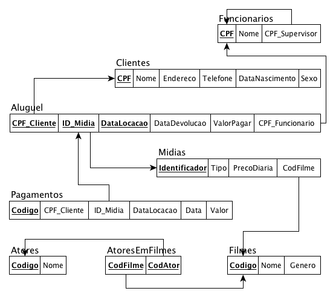

# HO11
## Enunciado:
Construir um índice multinível estático na chave primária e índices multinível dinâmicos com árvore B+ em cada chave estrangeira para cada arquivo (tabela) presente no modelo relacional abaixo, apresentando a blocagem (fator de bloco), o número de blocos necessários para armazenar o índice, o espaço total gasto para armazenar cada arquivo de índice e o número de acessos a blocos necessários para recuperar um registro usando cada índice construído.

Considere que o ponteiro para blocos de disco tem 16B, que o tamanho de bloco de disco é de 2KB, que um nó de árvore B+ seja armazenado em um bloco de disco, que a ocupação na árvore B+ seja de 69%, que cada ponteiro de nó da árvore B+ ocupe 12B, que os arquivos possuem registros de tamanho fixo, não espalhados e que eles têm a seguinte configuração de número de registros e tamanhos de campos:

- Atores (10.000 registros) → Codigo (16B), Nome (160B)
- Clientes (100.000 registros) → CPF (11B), Nome (160B), Endereco (200B), Telefone (16B), 
- DataNascimento (12B), Sexo (1B)
- Filmes (2.000.000 registros) → Codigo (16B), Nome (160B), Genero (80B)
- Funcionarios (3.500 registros) → CPF (11B), Nome (160B)
- Midias (10.000.000 registros) → Identificador (24B), Tipo (8B), PrecoDiaria (24B)
- Aluguel (20.000.000 registros)  → DataLocacao (12B), DataDevolucao (10B), ValorPagar (24B)
- Pagamentos (50.000.000 registros) → Codigo (48B), Data (12B), Valor (24B)
- AtoresEmFilmes (1.000.000 registros)
Observem a existência de chaves estrangeiras que obviamente devem ser consideradas como campos integrantes dos arquivos.

## Respostas: Índices Multinível Estático e Dinâmico (Árvore B+)

- **Dados do problema:**
    - Tamanho do Ponteiro de Bloco: 16B
    - Tamanho do Ponteiro de Nó (Árvore B+): 12B
    - Tamanho do Bloco de Disco: 2KB (ou seja, 2048 Bytes)
    - Ocupação da Árvore B+: 69%

- **Formulas que serão usadas:**
    - **Arquivo de Dados:**
        - Tamanho do Registro (R) = Soma dos campos
        - Fator de Bloco (F) = piso(2048 / R)
        - Número de Blocos (B) = teto(Total de Registros / F)
    - **Índice Multinível Estático (PK):**
        - Fator de Bloco do Índice (fo) = piso(2048 / (Tam_PK + 16))
        - Blocos Nível 1 = teto(B / fo)
        - Blocos Nível 2 = teto(Blocos Nível 1 / fo), e assim por diante.
        - Acessos = h (altura do índice) + 1
    - **Índice Multinível Dinâmico - Árvore B+ (FK):**
        - Fator de Bloco Efetivo na Folha (F_B+_ocupado) = teto(piso((2048 - 12) / (Tam_FK + 16)) * 0.69)
        - Ponteiros Efetivos por Nó de Índice (P_no) = teto(piso((2048 - 12) / (Tam_FK + 12)) * 0.69) + 1
        - Blocos de Folha = teto(Total de Registros / F_B+_ocupado)
        - Blocos de Índice Nível 1 = teto(Blocos de Folha / P_no), e assim por diante.
        - Acessos = h (altura total da árvore) + 1

---
### 1. Tabela **ATORES**
- **Dados:** 10.000 registros, PK: `Codigo` (16B).
- **Arquivo de Dados:** R = 176B, F = 11, B = 910 blocos.

- **Índice Multinível Estático em `Codigo` (PK):**
    - **Fator de Bloco (fo):** fo = piso(2048 / (16 + 16)) = 64
    - **Cálculo dos Níveis (h=2):**
        - Nível 1: teto(910 / 64) = 15 blocos
        - Nível 2 (Raiz): teto(15 / 64) = 1 bloco
    - **Blocagem (fo):** 64
    - **Número de Blocos do Índice:** 15 + 1 = 16 blocos
    - **Espaço Total:** 16 * 2048B = 32.768B (32 KB)
    - **Acessos a Bloco:** 2 + 1 = 3

---
### 2. Tabela **CLIENTES**
- **Dados:** 100.000 registros, PK: `CPF` (11B).
- **Arquivo de Dados:** R = 400B, F = 5, B = 20.000 blocos.

- **Índice Multinível Estático em `CPF` (PK):**
    - **Fator de Bloco (fo):** fo = piso(2048 / (11 + 16)) = 75
    - **Cálculo dos Níveis (h=3):**
        - Nível 1: teto(20000 / 75) = 267 blocos
        - Nível 2: teto(267 / 75) = 4 blocos
        - Nível 3 (Raiz): teto(4 / 75) = 1 bloco
    - **Blocagem (fo):** 75
    - **Número de Blocos do Índice:** 267 + 4 + 1 = 272 blocos
    - **Espaço Total:** 272 * 2048B = 557.056B (544 KB)
    - **Acessos a Bloco:** 3 + 1 = 4

---
### 3. Tabela **FILMES**
- **Dados:** 2.000.000 registros, PK: `Codigo` (16B).
- **Arquivo de Dados:** R = 256B, F = 8, B = 250.000 blocos.

- **Índice Multinível Estático em `Codigo` (PK):**
    - **Fator de Bloco (fo):** fo = piso(2048 / (16 + 16)) = 64
    - **Cálculo dos Níveis (h=3):**
        - Nível 1: teto(250000 / 64) = 3.907 blocos
        - Nível 2: teto(3907 / 64) = 62 blocos
        - Nível 3 (Raiz): teto(62 / 64) = 1 bloco
    - **Blocagem (fo):** 64
    - **Número de Blocos do Índice:** 3.907 + 62 + 1 = 3.970 blocos
    - **Espaço Total:** 3.970 * 2048B = 8.130.560B (~7.75 MB)
    - **Acessos a Bloco:** 3 + 1 = 4

---
### 4. Tabela **FUNCIONARIOS**
- **Dados:** 3.500 registros, PK: `CPF` (11B), FK: `CPF_Supervisor` (11B).
- **Arquivo de Dados:** R = 182B, F = 11, B = 319 blocos.

- **Índice Multinível Estático em `CPF` (PK):**
    - **Fator de Bloco (fo):** fo = piso(2048 / (11 + 16)) = 75
    - **Cálculo dos Níveis (h=2):**
        - Nível 1: teto(319 / 75) = 5 blocos
        - Nível 2 (Raiz): teto(5 / 75) = 1 bloco
    - **Blocagem (fo):** 75
    - **Número de Blocos do Índice:** 5 + 1 = 6 blocos
    - **Espaço Total:** 6 * 2048B = 12.288B (12 KB)
    - **Acessos a Bloco:** 2 + 1 = 3

- **Árvore B+ em `CPF_Supervisor` (FK 11B):**
    - **Fator de Bloco (Folhas):** F_B+_ocupado = 52
    - **Ponteiros por Nó (Índice):** P_no = 62
    - **Cálculo dos Níveis (h=3):**
        - Nível 0 (Folhas): teto(3500 / 52) = 68 blocos
        - Nível 1 (Índice): teto(68 / 62) = 2 blocos
        - Nível 2 (Raiz): teto(2 / 62) = 1 bloco
    - **Blocagem (Fator Efetivo):** 52
    - **Número de Blocos do Índice:** 68 + 2 + 1 = 71 blocos
    - **Espaço Total:** 71 * 2048B = 145.408B (~142 KB)
    - **Acessos a Bloco:** 3 + 1 = 4

---
### 5. Tabela **MIDIAS**
- **Dados:** 10.000.000 registros, PK: `Identificador` (24B), FK: `CodFilme` (16B).
- **Arquivo de Dados:** R = 72B, F = 28, B = 357.143 blocos.

- **Índice Multinível Estático em `Identificador` (PK):**
    - **Fator de Bloco (fo):** fo = piso(2048 / (24 + 16)) = 51
    - **Cálculo dos Níveis (h=4):**
        - Nível 1: teto(357143 / 51) = 7.003 blocos
        - Nível 2: teto(7003 / 51) = 138 blocos
        - Nível 3: teto(138 / 51) = 3 blocos
        - Nível 4 (Raiz): teto(3 / 51) = 1 bloco
    - **Blocagem (fo):** 51
    - **Número de Blocos do Índice:** 7.003 + 138 + 3 + 1 = 7.145 blocos
    - **Espaço Total:** 7.145 * 2048B = 14.632.960B (~13.95 MB)
    - **Acessos a Bloco:** 4 + 1 = 5

- **Árvore B+ em `CodFilme` (FK 16B):**
    - **Fator de Bloco (Folhas):** F_B+_ocupado = 44
    - **Ponteiros por Nó (Índice):** P_no = 51
    - **Cálculo dos Níveis (h=5):**
        - Nível 0 (Folhas): teto(10000000 / 44) = 227.273 blocos
        - Nível 1 (Índice): teto(227273 / 51) = 4.457 blocos
        - Nível 2 (Índice): teto(4457 / 51) = 88 blocos
        - Nível 3 (Índice): teto(88 / 51) = 2 blocos
        - Nível 4 (Raiz): teto(2 / 51) = 1 bloco
    - **Blocagem (Fator Efetivo):** 44
    - **Número de Blocos do Índice:** 227.273 + 4.457 + 88 + 2 + 1 = 231.821 blocos
    - **Espaço Total:** 231.821 * 2048B = 474.769.408B (~452.79 MB)
    - **Acessos a Bloco:** 5 + 1 = 6

---
### 6. Tabela **ALUGUEL**
- **Dados:** 20.000.000 registros, PK composta (47B), FKs: `CPF_Cliente` (11B), `ID_Midia` (24B), `CPF_Funcionario` (11B).
- **Arquivo de Dados:** R = 92B, F = 22, B = 909.091 blocos.

- **Índice Multinível Estático na PK Composta (47B):**
    - **Fator de Bloco (fo):** fo = piso(2048 / (47 + 16)) = 32
    - **Cálculo dos Níveis (h=4):**
        - Nível 1: teto(909091 / 32) = 28.410 blocos
        - Nível 2: teto(28410 / 32) = 888 blocos
        - Nível 3: teto(888 / 32) = 28 blocos
        - Nível 4 (Raiz): teto(28 / 32) = 1 bloco
    - **Blocagem (fo):** 32
    - **Número de Blocos do Índice:** 28.410 + 888 + 28 + 1 = 29.327 blocos
    - **Espaço Total:** 29.327 * 2048B = 60.061.696B (~57.28 MB)
    - **Acessos a Bloco:** 4 + 1 = 5

- **Árvore B+ em `CPF_Cliente` e `CPF_Funcionario` (FK 11B):**
    - **Fator de Bloco (Folhas):** F_B+_ocupado = 52
    - **Ponteiros por Nó (Índice):** P_no = 62
    - **Cálculo dos Níveis (h=5):**
        - Nível 0 (Folhas): teto(20000000 / 52) = 384.616 blocos
        - Nível 1 (Índice): teto(384616 / 62) = 6.204 blocos
        - Nível 2 (Índice): teto(6204 / 62) = 101 blocos
        - Nível 3 (Índice): teto(101 / 62) = 2 blocos
        - Nível 4 (Raiz): teto(2 / 62) = 1 bloco
    - **Blocagem (Fator Efetivo):** 52
    - **Número de Blocos:** 384.616 + 6.204 + 101 + 2 + 1 = 390.924 blocos
    - **Espaço Total:** 390.924 * 2048B = 800.612.352B (~763.54 MB)
    - **Acessos a Bloco:** 5 + 1 = 6

- **Árvore B+ em `ID_Midia` (FK 24B):**
    - **Fator de Bloco (Folhas):** F_B+_ocupado = 35
    - **Ponteiros por Nó (Índice):** P_no = 40
    - **Cálculo dos Níveis (h=5):**
        - Nível 0 (Folhas): teto(20000000 / 35) = 571.429 blocos
        - Nível 1 (Índice): teto(571429 / 40) = 14.286 blocos
        - Nível 2 (Índice): teto(14286 / 40) = 358 blocos
        - Nível 3 (Índice): teto(358 / 40) = 9 blocos
        - Nível 4 (Raiz): teto(9 / 40) = 1 bloco
    - **Blocagem (Fator Efetivo):** 35
    - **Número de Blocos:** 571.429 + 14.286 + 358 + 9 + 1 = 586.083 blocos
    - **Espaço Total:** 586.083 * 2048B = 1.200.300.032B (~1.12 GB)
    - **Acessos a Bloco:** 5 + 1 = 6

---
### 7. Tabela **PAGAMENTOS**
- **Dados:** 50.000.000 registros, PK: `Codigo` (48B), FK composta (47B).
- **Arquivo de Dados:** R = 131B, F = 15, B = 3.333.334 blocos.

- **Índice Multinível Estático em `Codigo` (PK):**
    - **Fator de Bloco (fo):** fo = piso(2048 / (48 + 16)) = 32
    - **Cálculo dos Níveis (h=5):**
        - Nível 1: teto(3333334 / 32) = 104.167 blocos
        - Nível 2: teto(104167 / 32) = 3.256 blocos
        - Nível 3: teto(3256 / 32) = 102 blocos
        - Nível 4: teto(102 / 32) = 4 blocos
        - Nível 5 (Raiz): teto(4 / 32) = 1 bloco
    - **Blocagem (fo):** 32
    - **Número de Blocos do Índice:** 104.167 + 3.256 + 102 + 4 + 1 = 107.530 blocos
    - **Espaço Total:** 107.530 * 2048B = 220.221.440B (~210.02 MB)
    - **Acessos a Bloco:** 5 + 1 = 6

- **Árvore B+ na FK Composta (47B):**
    - **Fator de Bloco (Folhas):** F_B+_ocupado = 23
    - **Ponteiros por Nó (Índice):** P_no = 25
    - **Cálculo dos Níveis (h=6):**
        - Nível 0 (Folhas): teto(50000000 / 23) = 2.173.914 blocos
        - Nível 1 (Índice): teto(2173914 / 25) = 86.957 blocos
        - Nível 2 (Índice): teto(86957 / 25) = 3.479 blocos
        - Nível 3 (Índice): teto(3479 / 25) = 140 blocos
        - Nível 4 (Índice): teto(140 / 25) = 6 blocos
        - Nível 5 (Raiz): teto(6 / 25) = 1 bloco
    - **Blocagem (Fator Efetivo):** 23
    - **Número de Blocos:** 2.173.914 + 86.957 + 3.479 + 140 + 6 + 1 = 2.264.497 blocos
    - **Espaço Total:** 2.264.497 * 2048B = 4.637.689.856B (~4.32 GB)
    - **Acessos a Bloco:** 6 + 1 = 7

---
### 8. Tabela **ATORESEMFILMES**
- **Dados:** 1.000.000 registros, PK composta (32B), FKs: `CodFilme` (16B), `CodAtor` (16B).
- **Arquivo de Dados:** R = 32B, F = 64, B = 15.625 blocos.

- **Índice Multinível Estático na PK Composta (32B):**
    - **Fator de Bloco (fo):** fo = piso(2048 / (32 + 16)) = 42
    - **Cálculo dos Níveis (h=3):**
        - Nível 1: teto(15625 / 42) = 373 blocos
        - Nível 2: teto(373 / 42) = 9 blocos
        - Nível 3 (Raiz): teto(9 / 42) = 1 bloco
    - **Blocagem (fo):** 42
    - **Número de Blocos do Índice:** 373 + 9 + 1 = 383 blocos
    - **Espaço Total:** 383 * 2048B = 784.384B (766 KB)
    - **Acessos a Bloco:** 3 + 1 = 4

- **Árvore B+ em `CodFilme` e `CodAtor` (FK 16B):**
    - (O cálculo é idêntico para ambas as chaves, pois têm o mesmo tamanho).
    - **Fator de Bloco (Folhas):** F_B+_ocupado = 44
    - **Ponteiros por Nó (Índice):** P_no = 51
    - **Cálculo dos Níveis (h=4):**
        - Nível 0 (Folhas): teto(1000000 / 44) = 22.728 blocos
        - Nível 1 (Índice): teto(22728 / 51) = 446 blocos
        - Nível 2 (Índice): teto(446 / 51) = 9 blocos
        - Nível 3 (Raiz): teto(9 / 51) = 1 bloco
    - **Blocagem (Fator Efetivo):** 44
    - **Número de Blocos:** 22.728 + 446 + 9 + 1 = 23.184 blocos
    - **Espaço Total:** 23.184 * 2048B = 47.480.832B (~45.28 MB)
    - **Acessos a Bloco:** 4 + 1 = 5
