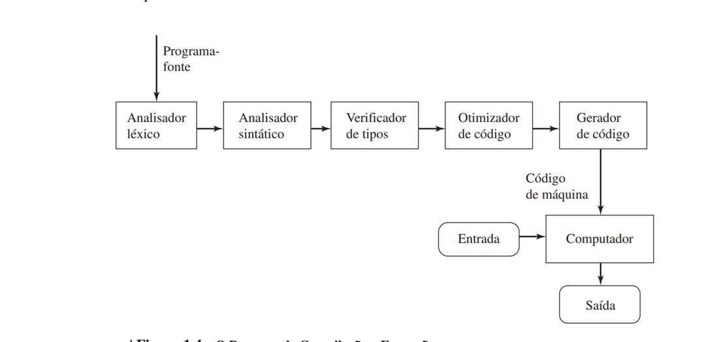
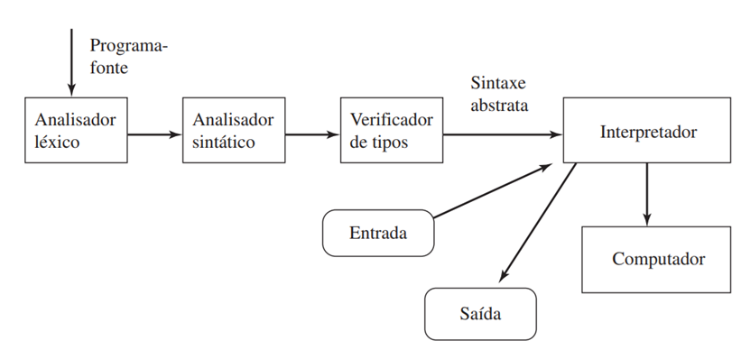

# Exercício 03 - Linguagens de Programação

## 1. Explique a razão da arquitetura do computador ser considerada como uma benção e maldição para projetistas de linguagem.

### R: 
FAZER

## 2. Indique se a seguinte frase é verdadeira ou falsa: A linguagem C foi projetada para ser de uso geral.

### R:
A frase é **verdadeira**.

**Explicação:**  
A linguagem C foi projetada para ser de uso geral, ou seja, não foi criada para um domínio ou aplicação específica. Seu objetivo era permitir o desenvolvimento de sistemas operacionais, compiladores, aplicativos e diversos tipos de software, oferecendo flexibilidade, eficiência e portabilidade. Por isso, C é amplamente utilizada em diferentes áreas da computação.

## 3. Quais são os benefícios da padronização da linguagem? Justifique sua resposta.

### R:
Os benefícios da padronização da linguagem são diversos e impactam positivamente desenvolvedores, empresas e a comunidade em geral. A padronização garante que a linguagem tenha uma especificação formal e única, permitindo que diferentes implementações (compiladores e interpretadores) sigam as mesmas regras. Isso traz:

- **Portabilidade:** Programas escritos em uma linguagem padronizada podem ser executados em diferentes sistemas e plataformas sem a necessidade de grandes adaptações.
- **Interoperabilidade:** Diferentes ferramentas e bibliotecas podem ser usadas em conjunto, pois seguem o mesmo padrão.
- **Confiabilidade:** O comportamento do código é previsível, pois todos seguem as mesmas regras e sintaxe.
- **Facilidade de aprendizado e documentação:** Materiais de estudo, livros e tutoriais seguem o padrão, facilitando o aprendizado e a troca de conhecimento.
- **Evolução controlada:** Mudanças e melhorias na linguagem são discutidas e aprovadas por comitês, evitando fragmentação e incompatibilidades.

*Exemplo:* A linguagem C possui um padrão (ANSI C/ISO C), o que permite que programas escritos em C possam ser compilados em diferentes sistemas operacionais e por diferentes compiladores, mantendo o mesmo padrão.

## 4. Apresente um argumento para a frase: "A padronização é uma influência negativa para o projeto de linguagens".

### R:
Muitos dizem que a padronização é uma influência negativa para o projeto de linguagens pois ela acabaca inibindo inovações em projetos de linguagem. Assim versões padronizadas e muito parecidas de linguagens tendem a durar muito tempo por conta dessa padronização que não dá espaço para novas formas de se construir uma linguagem,porém um contraponto a esse problema é que os padrões de linguagem ISO e ANSI, que são os mais utilizados pelas linguagens modernas, são revisitados a cada cinco anos, fornecendo assim um espaço para inovações.

## 5. Explique a razão de versões novas de uma linguagem serem compatíveis com versões anteriores, e apresente uma consequência negativa dessa tendência. Justifique sua resposta com exemplos.

### R:
Versões mais novas de linguagens são compatíveis com versões anteriores para garantir que programas mais antigos continuem a funcionar sem problemas na nova linguagem sem necessida de manutenções drasticas. Um problema gerado por isso é que as linguagens ficam cada vez maiores e mais complexas e dificulta a evolução dessas linguagens, pois é necessario manter recursos mal projetados ou obsoletos. Uma outra consequência negativa é para o aprendizado dessa linguagem, por elas estarem com cada vez mais recursos e serem cada vez mais complexas, se gera uma maior dificuldade de se aprender todos os aspectos dessa linguagem.
**Exemplo:**  
No JavaScript, por questões de compatibilidade, operadores e comportamentos problemáticos (como o uso de `==` para comparação frouxa) continuam existindo, mesmo sendo considerados fontes de bugs. Em C, funções antigas e inseguras como `gets()` ainda existem em alguns compiladores por compatibilidade, mesmo sendo desaconselhadas.
Portanto, embora a compatibilidade seja importante para a estabilidade e adoção de novas versões, ela pode prejudicar a clareza, segurança e evolução das linguagens de programação.

## 6. Defina   os   objetivos   de   simplicidade   e   de   legibilidade   em   uma   linguagem   de   programação, apresentando pontos positivos e negativos (com exemplos) de seus extremos.

### R:

**Simplicidade** em uma linguagem de programação refere-se à facilidade com que seus conceitos, comandos e estruturas podem ser compreendidos e utilizados. Uma linguagem simples possui poucas regras, sintaxe clara e poucos conceitos fundamentais, tornando o aprendizado mais rápido e reduzindo a possibilidade de erros.

- **Ponto positivo do extremo da simplicidade:**  
  Facilita o aprendizado para iniciantes e reduz a quantidade de erros de sintaxe.  
  *Exemplo:* Python é considerada uma linguagem simples, pois possui sintaxe enxuta e comandos intuitivos:
  ```python
  print("Olá, mundo!")
  ```
- **Ponto negativo do extremo da simplicidade:**  
  Pode limitar a expressividade e a capacidade de resolver problemas complexos, pois pode faltar recursos avançados ou abstrações poderosas.  
  *Exemplo:* Linguagens muito simples, como BASIC antigo, podem dificultar a implementação de programas grandes e complexos.

**Legibilidade** é a facilidade com que um código pode ser lido e entendido por humanos. Uma linguagem legível utiliza nomes descritivos, estrutura clara e sintaxe que se aproxima da linguagem natural, facilitando a manutenção e o trabalho em equipe.

- **Ponto positivo do extremo da legibilidade:**  
  Facilita a manutenção, revisão e colaboração em projetos, pois outros desenvolvedores conseguem entender rapidamente o código.  
  *Exemplo:* O uso de identação obrigatória em Python aumenta a legibilidade:
  ```python
  if idade >= 18:
      print("Maior de idade")
  ```
- **Ponto negativo do extremo da legibilidade:**  
  Buscar legibilidade máxima pode tornar a linguagem ou o código verboso e repetitivo, aumentando o tamanho do código e, em alguns casos, reduzindo a produtividade.  
  *Exemplo:* Em linguagens como COBOL, a sintaxe é extremamente próxima da linguagem natural, mas isso pode tornar o código muito extenso:
  ```cobol
  ADD 1 TO TOTAL-GERAL GIVING NOVO-TOTAL
  ```

**Resumo:**  
O equilíbrio entre simplicidade e legibilidade é fundamental. Simplicidade excessiva pode limitar a linguagem, enquanto legibilidade extrema pode gerar códigos longos e repetitivos. O ideal é buscar uma linguagem que seja simples o suficiente para ser aprendida facilmente, mas também legível e expressiva para facilitar a manutenção e o desenvolvimento de sistemas complexos.

## 7. Defina os seis principais tempos de ligação, fornecendo um exemplo para cada um: (i) tempo de definição da linguagem; (ii) tempo de implementação da linguagem; (iii) tempo de escrita do programa; (iv) tempo de compilação; (v) tempo de carga do programa; (vi) tempo de execução do programa.

### R: 

- (i) Tempo de definição da linguagem: Quando a linguagem é definida, os tipos básicos são ligados a rotulos especiais, definidos de palavras reservadas. Por exemplo em C, o for ou o int são palavras reservadas, sendo assim não podem ser redefinidas para serem usadas fora do escopo definido pela linguagem.
- (ii) Tempo de implementação da linguagem: Quando o compilador ou interpretador da linguagem é escrito, os valores são ligados a interpretações de máquina. Por exemplo, o tamanho de um int em C é determinado no momento de implementação da linguagem.
- (iii) Tempo de escrita do programa: Em algumas linguagens quando os programas são escritos, os nomes de variáveis são ligados a tipos. Por exemplo uma variável pode ser ligada ao seu tipo quando é declarada. Como no exemplo abaixo que liga a váriavel x ao tipo inteiro.
```
int x;
```
- (iv) Tempo de compilação: Quando um programa é compilado, os comando são ligados a sequências de instruções em linguagem de máquina.
- (v) Tempo de carga do programa: Quando o código de máquina é carregado, as variáveis estatícas são atribuídas a endereços fixos de memória, a pilha de tempo de execução é alocada a um bloco de memória e a mesma coisa com o proprio código de máquina.
- (vi) Tempo de execução do programa: Quando os programas são executados, as variáveis são ligadas a valores. 
```
x = 3;
```
## 8. Diferencie uma ligação precoce de uma tardia, apresentando benefício(s) e malefício(s) de cada uma, além de exemplos de linguagens que as utilizam.

### R:
Um elemento pode ser ligado a uma propriedade em qualquer uma das alternativas de tempo. Por exemplo, a ligação de uma valor com uma constante pode ser feita em tempo de compilação ou de carga ou no inicio da fase de execução. Quando essas escolhas são possíveis, a ligação precoce signiica que um elemento é ligado a uma propriedade o mais cedo possível nessa serie de tempo. A ligação tardia significa um atraso dessa ligação até o ultimo momento possível.
- Os pontos positivos da precoce são que ela geralmente é menos custosa e leve a uma melhor detecção de erros. 
- Os pontos positivos da tardia é que ela da uma maior flexibilidade na hora de programar.

## 9. Defina o conceito de confiabilidade de um programa, apresentando um trecho de programa em C/C++ onde tal objetivo é comprometido.

### R:

Confiabilidade de um programa refere-se à capacidade do software de funcionar corretamente, sem apresentar falhas, erros inesperados ou comportamentos indesejados, mesmo em situações adversas. Um programa confiável executa suas funções conforme especificado, lida adequadamente com entradas inválidas e evita vulnerabilidades que possam comprometer sua execução ou segurança.

**Exemplo de comprometimento da confiabilidade em C:**
```c
#include <stdio.h>
int main() {
    char nome[10];
    printf("Digite seu nome: ");
    gets(nome); // Uso de gets compromete a confiabilidade!
    printf("Olá, %s\n", nome);
    return 0;
}
```
No exemplo acima, o uso da função `gets` é perigoso porque não limita o número de caracteres lidos, podendo causar um estouro de buffer (buffer overflow). Isso pode levar a falhas, comportamentos inesperados ou até vulnerabilidades de segurança, comprometendo a confiabilidade do programa. O correto seria usar `fgets`, que permite limitar o tamanho da entrada:

```c
fgets(nome, sizeof(nome), stdin);
```

Outro exemplo da falta de confiabilidade em C e C++ é a soma de inteiros, que se execeder o número de bytes permitido, ou sejá, ocasionar overflow, o resultado da soma feita será completamente errado.

## 10. Qual o principal benefício da abstração em linguagens de programação? Qual era o procedimento quando tal ferramenta era ausente na linguagem?

### R:
O principal benefício da abstração em linguagens de programação é permitir que o programador utilize funcionalidades complexas sem precisar conhecer ou manipular todos os detalhes internos de sua implementação. Isso promove a reutilização de código, facilita a manutenção e torna o desenvolvimento mais eficiente. Exemplos de abstração incluem funções, procedimentos, módulos, classes e interfaces, como as bibliotecas de classes em Java ou funções em C.

Quando a abstração estava ausente nas linguagens, os programadores precisavam reimplementar rotinas semelhantes em diferentes partes do código, o que aumentava a chance de erros, dificultava a manutenção e tornava o código menos reutilizável. Além disso, a ausência de abstração dificultava a colaboração em equipe, pois cada desenvolvedor precisava entender todos os detalhes do código para utilizá-lo ou modificá-lo.

## 11. Explique o conceito de ortogonalidade em uma linguagem de programação, apresentando pontos positivos e negativos (com exemplos) de seus extremos.

### R:
Uma linguagem é dita ortogonal quando seus comandos e recursos são construídos sobre um conjunto pequeno e mutuamente independente de operações primitivas. Quanto mais ortogonal é uma linguagem menos regras são necessárias para se escrever programas corretos. Assim, programas em linguagem ortogonal tendem a ser mais simples e claros que em uma linguagem não-ortogonal.
Um exemplo de ortogonalidade é a passagem de argumentos em uma chamada de função. Uma linguagem muito ortogonal permite que qualquer tipo de objeto até mesmo uma definição de função, seja passado como argumento. Outras linguagens menos ortogonais restrigem os tipos de objetos que podem ser passados nessa chamada. A maioria das linguagens imperativas não permitem que definições de funções sejam passadas como argumento, por tanto por esse lado são não-ortogonais(em relação a esse ponto em específico). A ortogonalidade tende a se relacionar com a simplicidade conceitual, onde o programador não precisa conhecer diversas regras para a implementação do seu programa. Por outro lado a não-ortogonalidade está muitas vezes relacionada com a eficiência, pois suas regras excepcionais eliminam as possíbilidades do programador consumir mais tempo e espaço que o necessário na resolução de um problema no seu código.

## 12. Diferencie   os   processos   de   compilação   e   de   interpretação   de   linguagens   de   programação, apresentando exemplos de linguagens que utilizam somente um dos processos, ou mesmo que utilizam ambos. Quais as vantagens de um processo sobre o outro?

### R:
O processo de **compilação** consiste em traduzir todo o código-fonte de um programa para código de máquina (ou código intermediário) antes da execução. O resultado é um arquivo executável independente, que pode ser rodado várias vezes sem a necessidade do código-fonte original. Exemplos de linguagens compiladas são C e C++.

*Vantagens da compilação:*
- Maior desempenho na execução, pois o código já está traduzido para linguagem de máquina.
- Distribuição facilitada, pois o usuário final recebe apenas o executável.
- Detecção de muitos erros em tempo de compilação.



O processo de **interpretação** executa o código-fonte linha por linha, traduzindo e executando cada instrução em tempo real, sem gerar um arquivo executável independente. Exemplos de linguagens interpretadas são Python e JavaScript.

*Vantagens da interpretação:*
- Maior flexibilidade e facilidade para testar e depurar o código.
- Portabilidade, pois o mesmo código pode ser executado em diferentes sistemas com o interpretador adequado.
- Alterações no código podem ser testadas imediatamente, sem necessidade de recompilar.

Algumas linguagens utilizam **ambos os processos**. Por exemplo, Java é compilada para bytecode (código intermediário), que é então interpretado (ou compilado just-in-time) pela Máquina Virtual Java (JVM). Python também pode ser compilado para bytecode antes de ser interpretado pela máquina virtual.



*Resumo:*
- Compilação: tradução total antes da execução (ex: C, C++).
- Interpretação: tradução e execução linha a linha (ex: Python, JavaScript).
- Ambos: compilação para código intermediário + interpretação (ex: Java, Python).

Cada abordagem tem vantagens e desvantagens, e a escolha depende dos requisitos de desempenho, portabilidade e facilidade de desenvolvimento do projeto.


